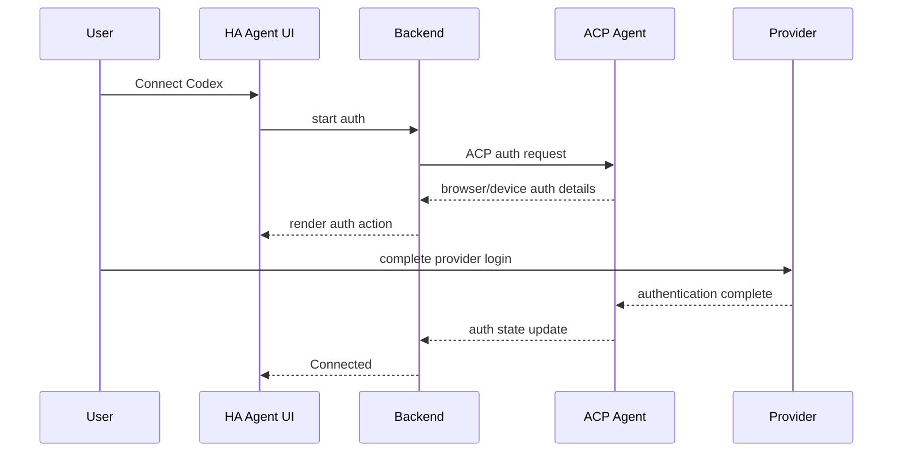

# ACP & Agent Backend Design

## 1. Decision

Use **Agent Client Protocol (ACP)** as the primary contract between Home Assistant Agent and coding-agent runtimes.

Avoid defining a broad custom provider API until an actual ACP limitation requires one.

## 2. Why ACP

ACP already models the interaction shape required by a rich coding-agent client:

- initialization/capability negotiation;
- authentication;
- sessions;
- prompts and streaming updates;
- plans/reasoning/tool activity;
- file changes;
- terminal activity;
- permission requests;
- MCP server injection;
- cancellation/resume.

It also creates a realistic multi-provider path:

- OpenAI Codex through `codex-acp`;
- Cursor through native `agent acp`;
- future ACP-native agents;
- user-configured custom ACP agents.

## 3. Codex implementation

### Preferred runtime

Use:

```text
@agentclientprotocol/codex-acp
```

Rather than directly building the product around the Codex TypeScript SDK.

### Rationale

`codex-acp` runs **Codex App Server**, which is OpenAI's rich-client interface used to power interactive Codex surfaces. This is more aligned with our use case than a thin SDK wrapper around one-shot `codex exec` execution.

It already maps Codex-native concepts into ACP, including:

- ChatGPT authentication;
- model/reasoning settings;
- approvals/sandbox modes;
- shell commands;
- file changes;
- MCP calls;
- plans/reasoning;
- session resume;
- client-provided MCP servers.

### Process invocation

Initial prototype:

```bash
npx -y @agentclientprotocol/codex-acp
```

Production app should install/pin the package in the image instead of downloading it at runtime.

### Provider home

Set provider state paths under persistent app data, e.g.:

```text
/data/providers/codex/
```

Avoid relying on an ephemeral container home directory.

## 4. Cursor implementation

Preferred runtime:

```bash
agent acp
```

The same ACP client layer should be able to launch it with provider-specific environment/setup only.

MVP does not require Cursor support, but the design should test a Cursor ACP smoke test before v1.0 to validate provider neutrality.

## 5. Custom ACP providers

Future advanced setting:

```yaml
providers:
  - id: my-agent
    name: My Agent
    command: /usr/local/bin/my-agent
    args: ["acp"]
    env:
      SOME_NON_SECRET_OPTION: value
```

Security constraints:

- custom binaries must exist inside the app image unless a deliberate plugin mechanism is introduced;
- never allow arbitrary shell command configuration from non-admin users;
- environment-secret values should be stored separately/redacted.

## 6. Provider registry

Internal provider metadata:

```ts
interface ProviderDefinition {
  id: string;
  displayName: string;
  kind: "codex" | "cursor" | "custom";
  command: string;
  args: string[];
  capabilities?: ProviderCapabilityHints;
}
```

`ProviderCapabilityHints` should only describe UI hints or known quirks. Runtime behavior must be negotiated through ACP wherever possible.

## 7. Authentication

### Principles

- Provider owns actual provider authentication semantics.
- Our UI renders ACP auth methods.
- App stores only what is necessary for the provider runtime to retain auth.
- Never request OpenAI/Cursor passwords directly.

### Example flow



Support browser/device flow according to whatever the provider advertises.

## 8. Session lifecycle

### Create

- select provider;
- verify provider runtime/auth;
- construct workspace settings;
- inject HA-MCP HTTP server;
- create ACP session;
- persist session metadata.

### Resume

- launch provider runtime if absent;
- load/resume ACP session;
- reconnect UI stream;
- reconcile provider history and locally persisted activity.

### Cancel

- send ACP cancellation/interrupt;
- mark current turn interrupted;
- preserve completed activity.

### Archive/delete

Archive should be non-destructive where supported.

Delete should distinguish:

- remove from our UI only;
- delete provider session if provider supports destructive deletion.

MVP may implement archive only.

## 9. MCP injection

Every Home Assistant-aware session receives one MCP server definition:

```text
name: home-assistant
transport: HTTP
url: <configured HA-MCP secret URL>
```

This should be passed through ACP session creation where supported.

Do not depend on globally modifying the agent's own configuration files.

## 10. Normalization layer

Although ACP is the backend protocol, the browser should receive our normalized event model.

Reasons:

- frontend must not depend on ACP wire-version details;
- we want HA-specific enriched event types;
- raw provider events vary in detail;
- browser transport needs replay sequence IDs.

The backend should retain a link to raw event payloads for expandable diagnostics.

See `09-frontend-event-contract.md`.

## 11. Capability negotiation

At runtime detect:

- auth support;
- session load/resume;
- permission requests;
- file-change events;
- MCP server injection;
- images/attachments;
- provider mode/model settings;
- subagents/forks if later exposed.

UI should degrade gracefully rather than assume Codex capabilities.

## 12. Provider-specific escape hatch

Allow a narrow provider plugin layer for cases ACP does not standardize well:

```ts
interface ProviderExtension {
  diagnostics?(): Promise<Record<string, unknown>>;
  enrichCapabilities?(caps: AcpCapabilities): ProviderCapabilities;
  normalizeProviderEvent?(event: unknown): NormalizedEvent | undefined;
}
```

Do not allow provider extensions to bypass the core ACP session path for ordinary prompting/tooling.

## 13. Acceptance tests

A provider is considered supported when it can:

1. initialize through ACP;
2. authenticate or report an authenticated state;
3. create a session rooted at `/homeassistant`;
4. receive the HA-MCP server definition;
5. stream a text response;
6. read a file;
7. emit a file-change event after a write;
8. perform an HA-MCP tool call;
9. surface a permission request where supported;
10. cancel and resume a conversation.

## 14. References

- ACP: <https://agentclientprotocol.com/>
- Codex ACP: <https://github.com/agentclientprotocol/codex-acp>
- OpenAI Codex: <https://github.com/openai/codex>
- Cursor ACP documentation: <https://cursor.com/docs/cli/acp>
