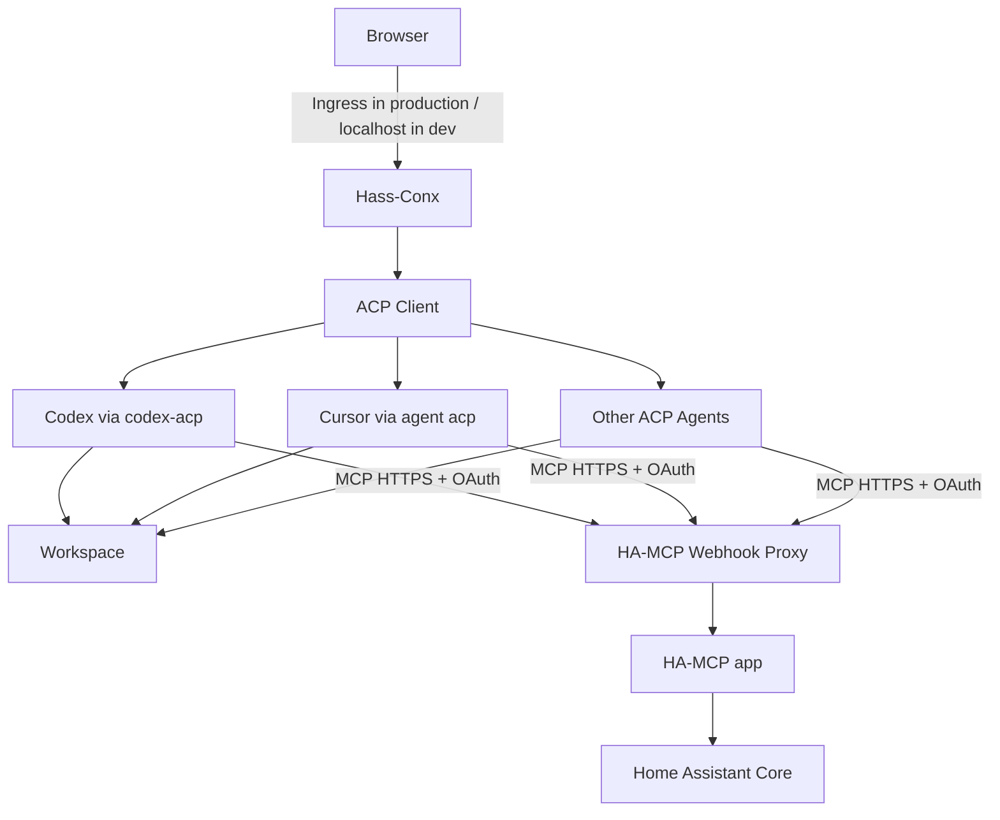

# Executive Summary

## Problem

Home Assistant has excellent configuration and runtime introspection surfaces, but there is no simple, Home Assistant-native browser experience that combines all of the following:

- a high-quality coding agent such as OpenAI Codex or Cursor;
- direct read/write access to the Home Assistant configuration workspace;
- live access to entity states, registries, history, automation traces, logs, dashboards, and services;
- conversational interaction inside the Home Assistant UI;
- visible tool activity, diffs, and permission requests;
- interchangeable agent backends rather than lock-in to a single harness;
- a productive local development loop where the application can run outside Home Assistant while still talking to a real Home Assistant instance over the network.

Existing solutions tend to own too much of the stack. They often bundle a custom agent harness, generic coding workbench, or provider layer that is difficult to adapt into a focused Home Assistant experience.

## Product thesis

Build a **thin Home Assistant-native product layer** over established agent runtimes and protocols rather than creating another agent harness.

The system deliberately delegates responsibilities:

| Concern | Owner |
|---|---|
| Reasoning, coding, shell, filesystem edits | Codex / Cursor / other agent |
| Generic agent-client protocol | ACP |
| Live Home Assistant API/tool surface | HA-MCP |
| Public/remote MCP ingress and OAuth | HA-MCP Webhook Proxy app |
| Browser UX, sessions, approvals, HA-specific rendering | Hass-Conx |
| Authentication into the embedded web app, app lifecycle | Home Assistant |

The app should feel like a first-party Home Assistant development and diagnostics tool, not a generic AI chat client embedded in Home Assistant.

## Proposed architecture

## Primary architectural decisions

### 1. ACP is the agent abstraction

Do not create a bespoke provider protocol unless required later. Use ACP as the primary internal contract between Hass-Conx and agent implementations.

Initial agent implementations:

- **Codex:** `agentclientprotocol/codex-acp`, which runs OpenAI Codex App Server and exposes it through ACP.
- **Cursor:** Cursor's native `agent acp` command.
- **Custom:** any user-provided ACP-compatible executable in a later advanced mode.

### 2. HA-MCP is the Home Assistant capability layer

Run the existing `homeassistant-ai/ha-mcp` app separately. Keep the existing **Webhook Proxy for HA-MCP** as the supported remote/public bridge and enable its `ha_auth` OAuth mode.

Hass-Conx injects the OAuth-protected public webhook URL into each agent session. It does not need to implement the Home Assistant MCP tool catalog itself.

HA-MCP owns access to live state, registries, traces, history, logs, dashboards, integrations, backups, services and Home Assistant configuration APIs.

### 3. Filesystem work remains native to the coding agent

In a Home Assistant app installation, Hass-Conx mounts `homeassistant_config` read/write and exposes it to the agent as the workspace.

In local development, the workspace path is configurable. Developers can use:

- a checked-out fixture/config repository for safe development;
- a locally mounted network share containing the real HA config when they deliberately want live file access;
- another arbitrary local directory for agent/UX development while HA-MCP still talks to the live HA instance.

HA-MCP's beta filesystem and raw YAML editing features should remain disabled by default so there is one clear file-mutation path.

### 4. Production and local development use the same application

The application must not assume Supervisor, Ingress, `/data`, or `/homeassistant` exist.

Runtime-specific behavior is configured at startup:

| Concern | Home Assistant app | Local development |
|---|---|---|
| Browser URL | HA Ingress | `http://localhost:<port>` |
| Workspace | `/homeassistant` mapped from HA config | configurable local path |
| App data | `/data` | configurable local data directory |
| HA-MCP | public webhook URL | same public webhook URL |
| MCP authentication | OAuth via Webhook Proxy | same OAuth flow |
| Web auth | Home Assistant Ingress | development-only local access |

This symmetry is a core maintainability requirement.

### 5. The browser UX is purpose-built for Home Assistant

The user experience prioritizes conversation, compact activity summaries, entity/state cards, trace visualizations, diffs, permissions, and clear diagnostic/admin capability states.

## MVP

A successful first release can:

1. run locally on a developer machine and later as a Home Assistant app from the same codebase;
2. sign in to Codex using the user's ChatGPT account;
3. start and resume a conversation;
4. read/write the configured workspace and show file changes;
5. connect to HA-MCP through the OAuth-enabled webhook proxy URL;
6. search/list live entities and retrieve automation traces;
7. render shell/file/MCP activity in the browser;
8. display and resolve permission requests;
9. run through Home Assistant Ingress in the packaged deployment.

## Product positioning

This is not a replacement for Home Assistant Assist, a generic LLM chat UI, another agent harness, an MCP server, or a browser IDE.

It is a **Home Assistant development, configuration, debugging, and maintenance agent UI**.

## Key references

- HA-MCP: <https://github.com/homeassistant-ai/ha-mcp>
- Codex: <https://github.com/openai/codex>
- Codex ACP adapter: <https://github.com/agentclientprotocol/codex-acp>
- Agent Client Protocol: <https://agentclientprotocol.com/>
- Home Assistant apps: <https://developers.home-assistant.io/docs/apps/>
