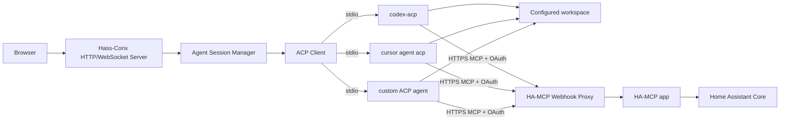

# Technical Design

## 1. Overview

Hass-Conx is one TypeScript application that supports two runtime environments:

- **Home Assistant app mode:** backend and React UI run in a Supervisor-managed container, frontend is served through Ingress, `/homeassistant` is a read/write config mount, and persistent state is under `/data`.
- **Local mode:** backend and frontend run directly on a workstation or in Docker, paths are supplied via configuration, and Home Assistant/HA-MCP are reached over the network.

The app does not implement model inference, a coding harness, or the Home Assistant MCP tool surface.

## 2. Runtime topology



## 3. Recommended implementation stack

- Node.js 22+
- TypeScript
- npm workspaces
- `apps/server`: Fastify + WebSocket support
- `apps/web`: React + Vite
- `packages/shared`: shared event/config schemas and types
- Vitest for unit/integration tests
- React Testing Library for component tests
- Playwright later for browser E2E

This stack is intentionally conventional so small coding agents can work on isolated tasks with little architectural inference.

## 4. Repository shape

```text
/
├── apps/
│   ├── server/
│   └── web/
├── packages/
│   └── shared/
├── addon/
│   └── config.yaml
├── docs/
├── Dockerfile
├── package.json
└── tsconfig.base.json
```

The HA app manifest should reference a published container image rather than requiring the app build context to contain the whole repository.

## 5. Unified runtime configuration

The backend must use one configuration object regardless of environment.

Conceptual schema:

```ts
export interface AppConfig {
  mode: "local" | "home-assistant";
  host: string;
  port: number;
  workspacePath: string;
  dataPath: string;
  haMcpUrl: string;
  logLevel: "debug" | "info" | "warn" | "error";
}
```

Environment variable defaults:

```text
HASS_CONX_MODE=local
HASS_CONX_HOST=127.0.0.1
HASS_CONX_PORT=3001
HASS_CONX_WORKSPACE_PATH=./dev/homeassistant-fixture
HASS_CONX_DATA_PATH=./.data
HASS_CONX_HA_MCP_URL=https://ha.example.com/api/webhook/mcp_xxx
```

HA app defaults override only the path/bind assumptions:

```text
HASS_CONX_MODE=home-assistant
HASS_CONX_HOST=0.0.0.0
HASS_CONX_PORT=8099
HASS_CONX_WORKSPACE_PATH=/homeassistant
HASS_CONX_DATA_PATH=/data
```

Do not scatter `process.env` reads throughout the codebase. Parse and validate configuration once at startup.

## 6. Local development loop

### Native mode

Expected workflow:

```bash
npm install
cp .env.example .env
npm run dev
```

`npm run dev` starts:

- backend with TypeScript watch/restart;
- Vite frontend with HMR;
- a dev proxy from the frontend to backend HTTP/WebSocket routes.

The developer points `HASS_CONX_HA_MCP_URL` at the existing OAuth-enabled Webhook Proxy URL.

### Workspace choices

Default local development uses a repository fixture:

```text
dev/homeassistant-fixture/
  configuration.yaml
  automations.yaml
  packages/
```

For deliberate testing against live config, the developer may set `HASS_CONX_WORKSPACE_PATH` to a locally mounted/replicated HA config directory. Hass-Conx itself does not own remote filesystem mounting.

This separation lets developers exercise live state/traces through HA-MCP without risking live filesystem edits during most UI/runtime development.

### Docker mode

```bash
docker build -t hass-conx:dev .
docker run --rm -p 3001:3001 \
  --env-file .env \
  -v "$PWD/dev/homeassistant-fixture:/workspace" \
  -v "$PWD/.data:/data" \
  -e HASS_CONX_WORKSPACE_PATH=/workspace \
  -e HASS_CONX_DATA_PATH=/data \
  hass-conx:dev
```

Docker mode validates filesystem, process and networking assumptions close to HA app deployment.

## 7. Home Assistant app packaging

Required runtime properties:

- Ingress enabled;
- read/write `homeassistant_config` mapping to `/homeassistant`;
- persistent `/data`;
- normal outbound network access to the configured HA-MCP webhook URL;
- no Docker socket, privileged mode or host networking.

Conceptual mapping:

```yaml
map:
  - type: homeassistant_config
    read_only: false
    path: /homeassistant
```

The application must not use the Supervisor API for core business logic. Supervisor-specific behavior should be limited to packaging/Ingress environment integration, preserving local-mode parity.

## 8. HA-MCP network path

Reference deployment:

```text
Hass-Conx agent
  -> public HTTPS /api/webhook/mcp_...
     -> Webhook Proxy for HA-MCP
        -> HA-MCP app private endpoint
           -> Home Assistant Core
```

Webhook Proxy configuration:

- OAuth enabled;
- OAuth mode `ha_auth`;
- remote/external URL configured or auto-detected;
- proxy points to the separate HA-MCP app.

Hass-Conx stores the endpoint URL as ordinary connection configuration. In `ha_auth` mode the URL is not treated as the authentication credential; OAuth bearer tokens are managed by the MCP client/agent runtime.

## 9. ACP client responsibilities

The backend handles:

- ACP initialize/capability negotiation;
- provider authentication requests;
- session create/load;
- prompt submission and cancellation;
- streamed session updates;
- permission requests;
- MCP server injection at session creation;
- provider process lifecycle.

Raw ACP messages may be debug-logged with redaction. Frontend receives a normalized Hass-Conx event model.

## 10. Session creation

Conceptually:

```ts
await agent.newSession({
  cwd: config.workspacePath,
  mcpServers: [
    {
      name: "home-assistant",
      transport: "http",
      url: config.haMcpUrl,
    },
  ],
});
```

The exact ACP SDK shape must follow the installed protocol version; the important invariant is that the MCP endpoint is supplied per session and not written into global Codex/Cursor user configuration.

## 11. OAuth responsibility

The target flow is standard MCP OAuth discovery initiated by the agent/MCP client when the HA-MCP webhook responds with an auth challenge.

Hass-Conx responsibilities:

- surface an authorization URL or auth-required state received via ACP/provider integration;
- open/offer that URL in the browser;
- reflect completion/failure;
- never collect the user's Home Assistant password.

If `codex-acp` does not currently surface downstream MCP OAuth adequately, implement the smallest upstream-compatible bridge/extension required. Do not replace HA-MCP/Webhook Proxy OAuth with a custom auth scheme.

## 12. Frontend/backend transport

Use one WebSocket connection per browser tab for commands/events and ordinary HTTP for health/config/bootstrap where simpler.

Browser messages include create/resume session, prompt, cancel, permission response and settings updates.

Server events follow `09-frontend-event-contract.md`.

The transport should support monotonically increasing sequence numbers and replay/recovery after short browser disconnects.

## 13. Persistence

Persist under `dataPath`:

- provider metadata/auth homes or references;
- session IDs/titles/provider mapping;
- UI preferences;
- HA-MCP endpoint;
- normalized activity summaries needed for UI recovery.

Do not duplicate the Home Assistant workspace or persist raw credentials in browser-visible state.

## 14. Filesystem editing model

Agent writes directly to `workspacePath` using its native coding tools.

Hass-Conx observes ACP file-change events and can use post-turn filesystem/git diff checks as a fallback.

HA-MCP filesystem/YAML beta tools remain off by default.

## 15. Environment parity rule

Every backend feature must work without Home Assistant-specific globals unless the task is explicitly Ingress/packaging related.

A feature is not considered complete until its unit/integration tests run in local mode. Deployment-specific tasks then verify the same behavior through HA Ingress.
