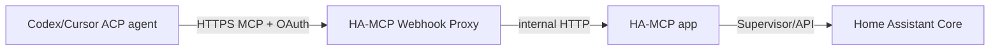

# HA-MCP Integration Design

## 1. Decision

Use `homeassistant-ai/ha-mcp` as the external Home Assistant capability layer.

Reference deployment uses two existing Home Assistant apps:

1. **Home Assistant MCP Server** (`ha-mcp`)
2. **Webhook Proxy for HA-MCP**

Hass-Conx consumes the proxy's public Streamable HTTP MCP endpoint and relies on the proxy's standard OAuth flow.

Repository: <https://github.com/homeassistant-ai/ha-mcp>

## 2. Why this boundary

HA-MCP owns a large and fast-changing Home Assistant tool surface including states, registries, automations/scripts/scenes, traces, history/statistics, logs/system health, dashboards, helpers, integrations, HACS, backups and service calls.

Reusing it avoids brittle Home Assistant-specific implementation in Hass-Conx.

## 3. Reference deployment



We intentionally retain the separate proxy app because it already solves remote routing and OAuth for the separately isolated HA-MCP app.

## 4. OAuth configuration

Webhook Proxy should be configured with:

```text
Enable OAuth: true
OAuth Mode: ha_auth
```

In this mode Home Assistant Core is the OAuth authorization server. MCP clients discover authentication from the webhook's protected-resource metadata and perform authorization-code + PKCE login against Home Assistant.

No static OAuth Client ID/Secret should be required for the normal `ha_auth` path.

The proxied MCP URL resembles:

```text
https://ha.example.com/api/webhook/mcp_<id>
```

With OAuth enabled, access is gated by a valid Home Assistant bearer token rather than possession of the URL alone.

### Security nuance

The Webhook Proxy `ha_auth` mode is an **access gate**, not per-user privilege delegation. HA-MCP itself still operates with the app's Home Assistant privileges. Therefore Hass-Conx remains an administrator-oriented tool and should not assume the authenticated HA user limits downstream tool privilege.

## 5. Hass-Conx configuration

Canonical setting:

```text
HASS_CONX_HA_MCP_URL=https://ha.example.com/api/webhook/mcp_<id>
```

The URL must be usable from both:

- the Home Assistant app container;
- a developer workstation/container on the network or internet.

This is why the public webhook endpoint is preferable to an internal/private HA-MCP URL as the default Hass-Conx contract.

A direct/private endpoint can remain an advanced troubleshooting fallback.

## 6. OAuth ownership

Hass-Conx should **not** implement the MCP authorization server and should not ask for a Home Assistant password.

Preferred path:

```text
agent runtime -> HA-MCP webhook -> OAuth challenge
agent runtime -> exposes auth requirement via ACP
Hass-Conx -> presents authorization URL to user
browser -> Home Assistant login/consent
agent runtime -> receives/stores/refreshes token
```

The first interoperability spike must verify how `codex-acp` exposes downstream MCP OAuth to its ACP client. If a small ACP extension is required, keep it provider/protocol focused and upstream-compatible.

## 7. Local development

Local Hass-Conx uses the exact same MCP URL as the packaged HA app:

```bash
HASS_CONX_HA_MCP_URL=https://hass.example.com/api/webhook/mcp_xxx npm run dev
```

This provides live Home Assistant state, traces and registries while Hass-Conx runs entirely outside HA.

No Supervisor access is required.

The local filesystem workspace is independent of this connection and may be a safe fixture or a deliberately mounted real config directory.

## 8. Health/status checking

Hass-Conx should distinguish:

- endpoint unreachable;
- endpoint reachable but OAuth required/not yet authenticated;
- MCP initialized;
- MCP initialized but expected tools unavailable;
- OAuth/authentication failed.

Do not consider `401` from an OAuth-protected endpoint equivalent to "HA-MCP is down".

Where possible, rely on the agent runtime's MCP connection status because it owns OAuth credentials.

## 9. Tool policy

Keep HA-MCP beta file/YAML/code-mode capabilities off by default:

- filesystem tools;
- raw YAML editing;
- code-mode/custom-tool escape hatch.

The coding agent already owns direct filesystem edits through the configured workspace.

### Diagnostic/default profile

Prefer read/diagnostic tools: states, registries, traces, history, logs, config reads and validation.

### Admin profile

Broader stable HA-MCP mutation tools can be exposed explicitly. Because the Webhook Proxy's OAuth login does not constrain HA-MCP's effective downstream privileges, this profile must be treated as highly privileged.

## 10. Responsibility split

| Operation | Owner |
|---|---|
| read/edit workspace files | coding agent |
| source search/refactor | coding agent |
| live state | HA-MCP |
| entity/device/area registry | HA-MCP |
| traces/history/logs | HA-MCP |
| service calls | HA-MCP |
| UI/storage-mode config APIs | HA-MCP |
| remote MCP routing/OAuth | Webhook Proxy |
| MCP auth UX presentation | agent runtime + Hass-Conx UI |

## 11. Tool rendering

Frontend recognizes important HA-MCP tool families but retains a generic fallback.

Suggested renderer registry:

```ts
interface ToolRenderer {
  matches(server: string, tool: string): boolean;
  toViewModel(call: McpToolCall): ToolCardViewModel;
}
```

Initial specialized renderers:

- entity/state/search;
- automation traces;
- later history/service/config calls.

Unknown tools render as compact expandable JSON-safe activity cards.

## 12. Compatibility rule

Hass-Conx must never assume HA-MCP is on localhost or on the Home Assistant app network. Treat it as an ordinary authenticated HTTP MCP service.

That rule is essential to keep local development and future remote-agent deployments viable.
