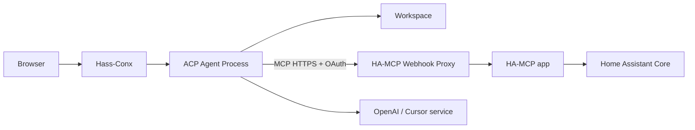

# Security & Permissions Design

## 1. Security posture

Hass-Conx intentionally gives a coding agent powerful access:

- read/write access to a configured workspace that may be the real Home Assistant config;
- shell/process capability inside the Hass-Conx runtime sandbox;
- live Home Assistant administrative tools through HA-MCP.

Treat it as an **administrator development tool**, not a household chat assistant.

## 2. Trust boundaries



Boundaries:

1. Browser ↔ app: Ingress authentication in HA mode; local developer boundary in local mode.
2. App ↔ agent: local ACP transport, normally stdio.
3. Agent ↔ workspace: configured filesystem path.
4. Agent ↔ HA-MCP: OAuth-protected public webhook endpoint.
5. Agent ↔ model provider: provider authentication/network connection.

## 3. User access

Packaged app mode should be administrator-only.

Local mode is a developer feature and must default to binding only to loopback (`127.0.0.1`). Exposing local mode on `0.0.0.0` is an explicit operator decision.

## 4. Filesystem access

### HA app mode

Default workspace is `/homeassistant`, mapped read/write from `homeassistant_config`.

### Local mode

Default to a safe fixture workspace. Access to real HA config requires the developer to explicitly choose/mount a path.

This prevents ordinary frontend/backend development from accidentally editing production HA files while still allowing live runtime inspection through HA-MCP.

### Sensitive files

`secrets.yaml`, `.storage/*`, custom integration secrets and any keys within the chosen workspace may be readable by the coding agent and may be transmitted to the selected cloud model provider.

The UI/docs must state this clearly.

## 5. HA-MCP OAuth

Canonical integration uses the Webhook Proxy with OAuth enabled in `ha_auth` mode.

Consequences:

- the webhook URL is not the primary credential;
- OAuth bearer/refresh tokens are sensitive;
- the agent/MCP client should own token persistence and refresh when possible;
- Hass-Conx must redact auth URLs only where they embed sensitive state, plus all Authorization headers and tokens;
- Hass-Conx must never request or store a Home Assistant password.

### Important privilege caveat

Webhook Proxy `ha_auth` validates that Home Assistant accepts the caller's token, but HA-MCP requests are executed with the HA-MCP app's own effective privileges. Do not treat OAuth login as per-user authorization of individual HA operations.

Coarse tool enablement and Hass-Conx/ACP permission policy remain necessary.

## 6. Capability profiles

### Diagnostic — recommended default

Allow states, registry reads, traces, history/statistics/logbook, config reads, logs/system health and validation.

Deny/disable device service calls, deletion, registry writes, restart/restore and other dangerous admin operations.

### Admin

Allows broader stable HA-MCP mutation tools after an explicit administrator choice and warning.

## 7. Interactive permissions

ACP/provider permission requests are the primary in-chat approval UX.

At minimum support:

- Reject
- Allow once

The UI must show the concrete operation, not just a generic "tool call".

For file changes, distinguish proposed, applying, applied and failed. If the provider only emits file change after application, never imply approval is still pending.

## 8. Avoid double approvals

HA-MCP has independent security gates. Default design:

- HA-MCP enabled/disabled tool set = coarse capability boundary;
- ACP/provider approval = interactive boundary.

Additional HA-MCP gates may be enabled by advanced operators as defence-in-depth but are not the primary UX.

## 9. Prompt injection / untrusted data

Logs, entity names, dashboards, notifications, files and web content can contain adversarial instructions.

Mitigations:

- retain the native agent sandbox/approval model;
- keep destructive HA-MCP tools disabled by default;
- do not execute model/tool output in privileged backend code outside the normal agent path;
- do not add hidden autonomous Home Assistant actions.

## 10. Shell/network access

Default Codex sandbox should be workspace-limited. Do not mount host root, Docker socket or Supervisor control sockets.

Normal outbound connectivity is required for provider access and the public HA-MCP endpoint.

## 11. Logging and redaction

Redact:

- OAuth access/refresh tokens;
- Authorization headers;
- API keys;
- provider credentials;
- callback query parameters containing authorization codes/state where appropriate.

Raw prompts/tool payloads should be debug/opt-in because they may contain household data and secrets.

## 12. Local dev security

Defaults:

```text
host = 127.0.0.1
workspace = dev fixture
no TLS assumed because loopback only
```

If the user binds local mode to a non-loopback address, log a prominent warning. Do not silently expose an unauthenticated development UI to the LAN.

Docker examples should mount only the selected workspace and data directory.

## 13. Security acceptance tests

- local mode binds loopback by default;
- packaged app is not accessible to unintended HA users;
- OAuth tokens/Authorization headers never appear in browser event payloads or normal logs;
- rejected ACP permission produces no requested side effect;
- disabled HA-MCP mutation tools are unavailable;
- fixture workspace is used by default in local development;
- container has no Docker socket/host-root access;
- provider auth persists without exposing tokens to frontend JavaScript.
