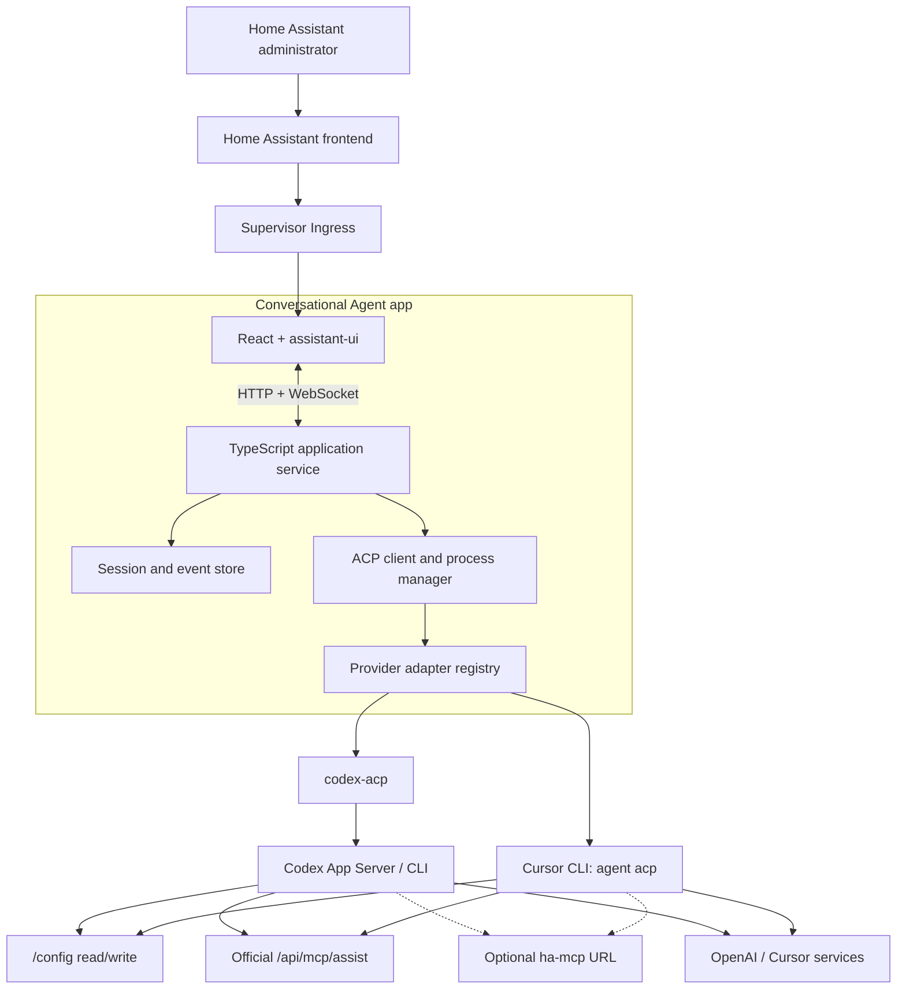
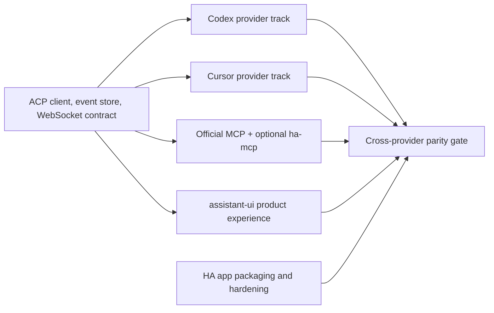

# Home Assistant Conversational Agent — High-Level Technical Design

**Status:** Proposed architecture, reconciled with Spike 008 and authenticated provider qualification

**Audience:** Engineering and technical reviewers

**Last updated:** 2026-08-30

## 1. Purpose

This document describes a high-level implementation for an administrator-only Home Assistant app that hosts a conversational UI and drives Codex and Cursor through Agent Client Protocol (ACP).

It intentionally leaves model reasoning, generic agent execution, and Home Assistant tool definitions to upstream systems. The application owns orchestration, authentication UX, session projection, persistence, and Home Assistant-specific presentation.

## 2. Architectural decisions

| Concern | Decision |
|---|---|
| Deployment | Home Assistant app for Home Assistant OS and Supervised |
| Architectures | `amd64` and `aarch64` |
| Browser access | Administrator-only Home Assistant Ingress |
| Frontend | React application composed from assistant-ui primitives |
| Backend | TypeScript service using the official ACP TypeScript SDK, running as UID 1000 |
| Agent protocol | Stable ACP v1, version-pinned |
| MVP agents | Codex through `@agentclientprotocol/codex-acp`; Cursor through native `agent acp` |
| Provider priority | Equal, parallel MVP tracks with shared conformance tests |
| Agent workspace | Complete Home Assistant configuration, including root-owned files, mounted read/write at `/config` |
| Provider process identity | Capability-free UID 0 with `NoNewPrivs`; separate from the UID-1000 backend |
| Official HA tools | Home Assistant Assist MCP at the internal Core API endpoint |
| Advanced HA tools | Optional user-supplied `ha-mcp` Streamable HTTP URL |
| Web transport | App-specific HTTP and WebSocket API through Ingress |
| Persistence | Local SQLite/event data and provider state under the app data directory |
| Tenancy | One shared administrative workspace per app installation |
| Recovery | No app-created backups, checkpoints, commits, or rollback |

## 3. System context



## 4. Home Assistant app packaging

The app is a pre-built multi-architecture container distributed through a Home Assistant app repository.

The release image must use a pinned glibc-based base. The observed Cursor Agent
packages for both target architectures require glibc and did not run on the
common Alpine/musl Home Assistant base, including with a `gcompat` experiment.
The release manifest records the base digest, target architecture, provider
artifact URL, expected byte length and SHA-256, provider version, source
retrieval date, lockfile/toolchain versions, and final OCI signature. Cursor
auto-update is disabled; provider upgrades occur only through a new qualified
app image.

Bundling Cursor is a hard release gate, not an assumed right. The project must
obtain written Anysphere redistribution permission or an accepted legal opinion
covering the selected packaging model. A user-triggered runtime download is a
separate legal and supply-chain decision, not an automatic workaround.

The app configuration should use the following posture:

- `ingress: true`
- `ingress_stream: true` for streamed HTTP and WebSocket behavior
- `panel_admin: true` (sidebar visibility only; backend authorization is independent)
- `homeassistant_api: true`
- `homeassistant_config` mapped read/write to `/config`
- app data mounted at the standard writable `/data` location
- no public host port by default
- no host networking
- Home Assistant protection mode enabled with the default AppArmor profile
- a reviewed custom AppArmor profile only if required by the final process design
- no Docker socket, host PID, or broad Supervisor administration access

Ingress terminates Home Assistant authentication. `panel_admin` controls whether
the app is shown in the administrator sidebar; it is not an authorization
boundary. The backend independently validates that requests came through
Ingress, requires `X-Remote-User-Id`, and verifies through Home Assistant's
admin-only user API that the referenced user is active and belongs to the
administrator group. It uses the remaining `X-Remote-User-*` headers only for
audit display. All administrators share one application workspace, credentials,
and session catalog.

The application listens only on its Ingress port and rejects connections not originating from the Supervisor Ingress proxy.

## 5. Application components

### 5.1 Web frontend

The frontend is a React single-page application built from assistant-ui primitives.

Use assistant-ui's `ExternalStoreRuntime` because the backend and ACP event log, rather than assistant-ui, own the durable conversation state. The runtime adapter projects backend messages and activities into assistant-ui message parts and capabilities.

Primary UI surfaces:

- shared conversation list;
- streaming conversation thread;
- grouped activity timeline;
- generic and Home Assistant-specific MCP tool cards;
- shell command and terminal output cards;
- file-change and diff cards;
- ACP permission controls;
- ACP elicitation forms and external-login links;
- provider/model/mode selector based on negotiated capabilities;
- setup, connection, and diagnostic settings.

The frontend must not parse raw ACP as its source of truth. It consumes a stable, application-owned projection so ACP upgrades and provider extensions remain backend concerns.

### 5.2 Application service

The TypeScript backend owns:

- Ingress request validation;
- REST endpoints for settings, session lists, and snapshots;
- WebSocket connections for ordered live events and commands;
- the trust acknowledgement;
- provider authentication orchestration;
- ACP subprocess lifecycle;
- session creation, resume, prompt, cancel, and permission responses;
- normalized event persistence;
- official MCP and optional `ha-mcp` configuration;
- redaction in logs and diagnostic exports;
- health and compatibility reporting.

It does not implement an agent loop or execute model tool calls on behalf of the agent.

### 5.3 ACP process manager

The process manager launches agent executables as child processes and connects their stdin/stdout to the official ACP TypeScript SDK.

A safe default is one ACP subprocess per active conversation. This avoids assuming that every agent supports concurrent sessions correctly and limits one process failure to one active conversation. Idle processes can be stopped after a timeout; resuming a conversation starts a fresh process and calls the provider's ACP session-resume/load capability where supported.

Every process has an application process ID and monotonically increasing
session generation. Provider events, permissions, elicitations, and browser
responses are accepted only for the current process and generation. A backend
restart never assumes a child process survived, even if an operating-system
process remains temporarily visible.

Run the backend as UID 1000 and provider processes as capability-free UID 0
with `NoNewPrivs=1`, using distinct process environments and provider homes. A
scrubbed child environment and mode-`0600` files do not isolate secrets from a
same-user provider, which may inspect peer process environments or files. The
provider identity receives only `/config`, its own provider home, and the
runtime endpoints it needs. Spike 008 confirms this layout can write the
complete root-owned `/config` mount, including an existing mode-0644 file,
while retaining backend secret, process-environment, and Supervisor-token
isolation in the protected app.

The manager enforces:

- a bounded number of active agent processes;
- one foreground turn per session;
- startup, prompt, idle, and shutdown timeouts;
- stdout as ACP-only data and stderr as redacted provider logs;
- graceful cancellation followed by bounded process termination;
- cleanup of pending permissions and elicitations after crashes;
- version and capability capture during initialization.

### 5.4 Provider adapter registry

The provider registry contains declarative launch and compatibility logic, not a second agent protocol.

Each provider definition supplies:

- executable and arguments;
- isolated environment and provider home directory;
- supported authentication launch paths;
- expected ACP version range;
- known extension methods and event metadata;
- MCP injection strategy;
- session-resume behavior;
- version discovery and minimum supported version;
- redaction patterns and compatibility warnings.

All normal interaction still flows through ACP. Provider-specific logic is permitted only where ACP capabilities or the provider implementation differ, such as bootstrap authentication or generated MCP configuration.

## 6. ACP integration

### 6.1 Protocol baseline

Pin a tested ACP v1 SDK and validate the agent's negotiated protocol version during `initialize`. ACP v2 is draft and is out of scope until it becomes stable and both MVP providers support it.

The shared lifecycle is:

1. Spawn provider process.
2. Establish newline-delimited JSON-RPC over stdio.
3. Call `initialize` with supported client capabilities.
4. Authenticate if required.
5. Create, load, or resume an ACP session with `/config` as `cwd`.
6. Supply logical MCP server configuration.
7. Send prompts and persist ordered `session/update` events.
8. Forward permission and elicitation requests to the connected browser.
9. Return permission or elicitation responses to the same ACP connection.
10. Cancel, close, or reap the process when required.

Negotiate `session/load` and stable `session/resume` independently. Prefer
`session/load` when provider history replay is useful; otherwise use
`session/resume` when it can restore provider context without replaying
history. If neither is available, require a new provider session. Never rebuild
provider context by automatically resending locally stored user prompts. Use
`session/close` before process reaping when the provider advertises it.

### 6.2 Client capabilities

The client should implement or negotiate:

- session streaming and cancellation;
- permission requests and all provider-supplied decision options;
- URL and form elicitation;
- session resume/load;
- modes and configuration options;
- plans and slash commands where supported;
- terminal output presentation;
- file-change presentation;
- images and resource links where useful;
- provider extension handling with generic fallback.

The agent itself retains filesystem and terminal execution. The application should not advertise ACP client filesystem or terminal capabilities unless a provider demonstrably requires them; duplicating execution in the host would blur responsibility and expand the attack surface.

### 6.3 Normalized browser event projection

ACP remains the agent protocol, but the browser needs durable, reconnectable application state. The backend therefore stores and emits a loss-minimizing projection with event classes such as:

- `message.started`, `message.delta`, `message.completed`;
- `thought.delta` or reasoning summary where the provider exposes it;
- `tool.started`, `tool.updated`, `tool.completed`;
- `terminal.started`, `terminal.output`, `terminal.completed`;
- `file.changed`;
- `plan.updated`;
- `permission.requested`, `permission.resolved`;
- `elicitation.requested`, `elicitation.resolved`;
- `turn.state`;
- `session.capabilities`;
- `error`.

Every event has a session-scoped monotonic sequence number, process ID,
generation, source, and fidelity classification. Sources distinguish at least
`acp.session.update`, `acp.client.rpc`, `provider.extension`, and an optional
`external.snapshot`; fidelity distinguishes provider-reported,
client-observed, and post-hoc-observed activity. Reconnecting clients send their
latest sequence and receive a snapshot plus the strict missing suffix. Unknown
ACP updates are retained as generic activity with bounded, redacted metadata
rather than discarded.

This projection is not a complete filesystem or MCP audit. Provider-owned
shell commands and MCP tools can produce effects without an ACP file event,
diff, location, or permission request. Render only supplied diffs and locations
as such, label provenance, and never infer that an absent event means no change
occurred. An external snapshot detector is not part of the MVP; if added later,
it is post-hoc detection rather than attribution, checkpointing, or rollback.

This projection is not exposed as a reusable agent protocol and does not contain agent execution semantics.

## 7. Provider integrations

### 7.1 Codex

Use the maintained [`@agentclientprotocol/codex-acp`](https://github.com/agentclientprotocol/codex-acp) package, not the archived `zed-industries/codex-acp` implementation.

The adapter starts Codex App Server and exposes ACP events for shell commands, file changes, MCP calls, permissions, plans, session state, and authentication.

#### ChatGPT subscription authentication

The app advertises ACP URL elicitation support and starts the Codex device-code flow. The UI displays the verification URL and one-time code, opens the external browser flow, and waits for the ACP completion event. Credentials remain in Codex's provider home and are never transported through the browser after authentication.

The ordinary Codex browser-login flow currently uses a localhost callback and
is not Ingress-safe. Do not expose it for MVP. Device-code authentication is
the subscription path unless an upstream remote-browser flow is explicitly
qualified later.

Use a dedicated `CODEX_HOME` under `/data/provider-state/codex`. File-based credential storage may be necessary because a container keyring is not expected. Credential files within that home, such as `auth.json`, must be mode `0600`, excluded from app backups and diagnostic output, and treated as secrets.

#### API-key authentication

The settings UI accepts an OpenAI API key into a write-only secret control. The backend supplies it only to the Codex process through the supported environment/authentication path.

This path is a supported MVP feature but initially has an explicit `unverified` test status because the project has no real API-key credential with which to run an end-to-end test. Unit tests may validate secret handling and the ACP selection path, but release notes and the capability matrix must distinguish those tests from real authentication.

### 7.2 Cursor

Use Cursor's native `agent acp` process and the `cursor_login` ACP authentication method where possible.

For initial browser bootstrap, run the pinned CLI with browser opening disabled
and pass the resulting external login action through the transient elicitation
UI. Never persist a Cursor challenge URL in events, browser history generated
by this app, or diagnostics. Confirm authoritative account status after
completion and after every app restart.

Use a dedicated Cursor configuration/home directory under `/data/provider-state/cursor`. Disable or control automatic CLI updates so the running binary cannot drift beyond the tested ACP compatibility range. Container releases should pin a known Cursor CLI version or checksum.

The observed packages require a glibc runtime. Install the approved package at
an immutable, versioned, architecture-specific path, verify its expected length
and independently recorded SHA-256, and launch it with auto-update disabled.
The independently recorded digest detects drift but is not a publisher
signature. No Cursor binary is shipped until the redistribution gate in
section 4 is satisfied.

Cursor work proceeds in parallel with Codex, not after it. Early implementation spikes must prove:

- login can be completed from the web UI without terminal access;
- subscription credentials persist across app restarts;
- both `amd64` and `aarch64` binaries are available and functional;
- native ACP permission, mode, session, and cancellation behavior maps to the shared UI;
- official and optional MCP servers can be configured for ACP sessions;
- the CLI may be redistributed in the app image, or an acceptable installation mechanism exists;
- automatic update behavior can be made deterministic.

Attempt standard client-provided MCP servers first. The unauthenticated probes
only prove that the request can be serialized before the authentication gate;
they do not prove Cursor validates or connects to those servers. If an
authenticated contract test for the exact shipped binary rejects or ignores
the standard field, the Cursor adapter generates a runtime-only
`.cursor/mcp.json` tree under `/run/provider-config/cursor` and points Cursor at
it while linking only required persistent session/authentication state. It must
not alter the user's `/config/.cursor` files. Fail closed if neither path works.

### 7.3 Provider parity contract

An automated ACP contract harness drives the same logical test suite against both providers:

- initialize and capability negotiation;
- authentication-required and authenticated states;
- new and resumed session;
- streamed response;
- cancellation;
- permission request and resolution;
- file change;
- shell/terminal event;
- official MCP read and write;
- optional `ha-mcp` read and write;
- process crash and reconnect.

The goal is equivalent product behavior, not identical raw events. Verified differences are recorded in a checked-in capability matrix and rendered where relevant in the UI. A provider passes this gate only after authenticated tests against the exact shipped binary on both `amd64` and `aarch64`; fixture success and unauthenticated initialization are separate evidence classes.

### 7.4 Current provider qualification snapshot

The 2026-08-30 authenticated qualification run passed for the tested local
provider installations: Codex CLI `0.150.1` with
`@agentclientprotocol/codex-acp` `1.7.0`, and Cursor Agent
`2026.08.25-3e8eec`. Both passed ACP initialization, session creation,
streaming, cancellation, load after provider restart, standard local HTTP MCP
injection, and a harmless MCP tool call. Permission behavior remains
provider-defined; the safe command used in this run did not emit a permission
event. This evidence supersedes the earlier unauthenticated provider rows in
the spike reports for these tested builds only. It does not qualify packaged
multi-architecture images or live Home Assistant workflows.

Codex API-key authentication remains explicitly unverified. Cursor packaging
and redistribution approval remains a release gate, independent of the
successful native ACP qualification.

## 8. Home Assistant integration

### 8.1 Configuration workspace

Map `homeassistant_config` read/write to `/config` and set every ACP session's working directory to `/config`.

After the administrator completes the trust acknowledgement, the agent receives the complete directory without an application-level denylist. This includes `.storage`, `secrets.yaml`, databases, logs, and custom components when present.

Agent mode controls whether the provider is asked to operate read-only or with workspace writes, but the outer mount remains read/write. The backend must present the negotiated provider mode honestly; it must not claim that a UI label enforces a boundary the provider does not support.

The application does not create a staging copy, overlay filesystem, snapshot, Git repository, automatic commit, or rollback store. ACP file-change events and post-turn reports are presentation features only.

### 8.2 Official Assist MCP

Enable `homeassistant_api: true` for the app and connect to Home Assistant Core through the Supervisor proxy:

```text
http://supervisor/core/api/mcp/assist
```

Use `Authorization: Bearer $SUPERVISOR_TOKEN`. Never pass the Supervisor token to the browser or persist it; it is runtime app identity supplied by Supervisor.

The app performs an MCP initialize/health probe during onboarding and before session injection. A 404 or unavailable response is translated into instructions to install or enable Home Assistant's Model Context Protocol Server integration.

The Assist endpoint remains governed by Home Assistant's Assist exposure settings and tool surface. It is the primary connection for live context and ordinary exposed-entity control, not a replacement for full administrative APIs.

### 8.3 Optional `ha-mcp`

The administrator enters a Streamable HTTP URL obtained from their `ha-mcp` installation. The current recommended topology is the in-process HACS custom component, but the app treats the URL as opaque and may work with other supported `ha-mcp` deployments.

The backend:

- validates the URL format and MCP handshake;
- stores it as a secret with mode-restricted local storage;
- redacts the path, query, headers, and tokens from logs and browser events;
- probes server identity and tool availability;
- injects it into new ACP sessions alongside the official MCP server;
- reports connection failure without preventing official-MCP-only sessions;
- never auto-installs or updates `ha-mcp`.

`ha-mcp` filesystem and YAML editing features are off by default upstream and should remain off. Onboarding warns when overlapping filesystem tools are visible, because they bypass the intended direct-workspace path and may produce changes that provider file-change reporting cannot represent consistently. The app does not silently filter other `ha-mcp` read/write tools.

### 8.4 MCP injection compatibility

The logical MCP configuration contains stable names:

- `homeassistant-assist`
- `homeassistant-advanced` when `ha-mcp` is configured

Prefer standard ACP client-provided MCP configuration. Where an authenticated
test proves a provider cannot consume it, its adapter materializes equivalent
provider-native configuration under the app's runtime-only
`/run/provider-config/<provider>` tree. In either case, the provider receives a
backend-local, per-session broker URL and capability—not the upstream Home
Assistant URL, `SUPERVISOR_TOKEN`, or secret `ha-mcp` URL. The backend-owned
broker injects upstream authorization and preserves the stable logical names.

MCP credentials must not be written into `/config`, included in prompts, or returned in tool metadata.

## 9. Permissions and human interaction

The app surfaces, but does not replace, the agent runtime's permission system.

For every ACP permission request:

1. Persist a redacted pending record.
2. Send it only to authenticated Ingress clients.
3. Render the provider-supplied action, context, and decision options.
4. Return the exact selected option to the originating ACP request.
5. Persist the resolution and close the UI gate.

Pending interactions have explicit `pending`, `resolved`, `cancelled`,
`expired`, and `orphaned` states. Each is bound to the application session,
turn, provider request, process ID, process generation, and state version. A
short browser reconnect grace period may preserve a live request. On expiry,
request provider cancellation and reap a non-responsive process; do not choose
allow or reject for the user. Process loss or backend restart orphans the old
request, and a response for an old generation is rejected.

No permission is automatically granted because the browser disconnected, timed out, or restarted. Pending requests either survive a short reconnect window or are rejected/cancelled before the process is reaped.

The same flow applies to shell commands, MCP calls, and other actions only when the provider requests permission. Workspace edits and MCP writes may occur without a prompt when the selected provider mode permits them. The UI and documentation must make this limitation explicit.

ACP elicitations are separate from permissions. Form elicitations render validated controls; URL elicitations open an external browser context and display the destination domain. Elicitation credentials are never copied into the event store.

## 10. Session and persistence model

Use a local SQLite database under `/data` for application-owned metadata and normalized events.

High-level records:

- `settings`: acknowledgement, selected defaults, redacted connection metadata;
- `providers`: type, version, authentication status, capability snapshot;
- `sessions`: app ID, ACP/provider session ID, provider, model, mode, title, state, timestamps;
- `events`: ordered normalized activity with schema version, process/generation,
  source/fidelity, turn ID, and bounded redacted metadata;
- `processes`: session process ID, generation, state, start/end, and exit reason;
- `pending_interactions`: permissions and elicitations with process/turn/request
  correlation and explicit terminal state;
- `commands`: idempotency key, request fingerprint, expected sequence, and
  result without secret values;
- `app_events`: schema migration and app-upgrade records outside session
  sequences;
- `mcp_connections`: server name, enabled state, health, secret reference.

Application-managed secret URLs and keys live in mode-restricted files under `/data/secret-state`; non-secret provider session/configuration state lives under `/data/provider-state`. Provider-native authentication caches that must reside inside a provider home are treated as explicit secret-file exceptions. Plaintext secret values are not stored in SQLite event rows. The app package excludes `/data/secret-state` and known provider credential files from Home Assistant app backups, so a restored installation requires provider reauthentication and re-entry of the optional `ha-mcp` URL. Session history remains eligible for ordinary Home Assistant app backup and is disclosed as potentially sensitive data.

The event log is the browser replay source. The provider's session is the authority for future model context. On resume, the backend reconciles the provider session with the locally stored projection and marks discrepancies rather than replaying old user prompts as new prompts.

Mutation commands carry an idempotency key and expected session sequence. An
exact duplicate returns the recorded result; reused keys with different
requests and stale/future sequences are rejected. Schema migrations append app
metadata without rewriting historical events, and a newer unknown schema fails
closed.

Session deletion removes local events and asks the provider to delete its session when ACP supports deletion. If provider deletion is unavailable, the UI reports that only the app's local record was removed.

## 11. Web API shape

The exact schema is implementation work, but the transport has two responsibilities:

### HTTP

- bootstrap current user and Ingress base path;
- retrieve settings and health;
- list and retrieve session snapshots;
- submit or clear write-only provider/MCP secrets;
- export redacted diagnostics.

### WebSocket

- subscribe to ordered session events;
- create/resume a live session;
- send a prompt;
- cancel a turn;
- resolve permission requests and elicitations;
- update supported model/mode configuration;
- receive provider/process/connection state.

Every mutating command includes a session identifier and expected state/version to prevent stale tabs from answering the wrong permission or prompting the wrong session.

## 12. Security model

### 12.1 Trust assumptions

- Every app user is a trusted Home Assistant administrator.
- Provider accounts and conversations are shared across administrators.
- The selected model provider may receive any content the agent reads from `/config` or MCP.
- Home Assistant configuration, logs, databases, and MCP results may contain untrusted text capable of prompt injection.
- The agent is allowed to make real configuration changes and real-world device calls.
- The administrator has their own backup or version-control strategy.

### 12.2 Boundaries

- Home Assistant Ingress is the browser authentication boundary.
- The protected app container and AppArmor profile are the outer host boundary.
- Codex/Cursor sandbox and permission modes are inner, provider-specific boundaries.
- `/config` is intentionally inside the agent trust boundary.
- Provider credentials, Supervisor token, and secret MCP URL are outside the intended model context, although a compromised same-user process remains a threat.

### 12.3 Controls

- Keep Home Assistant app protection enabled.
- Do not expose a direct web port or use host networking.
- Run the backend as UID 1000 and provider processes as capability-free UID 0
  with `NoNewPrivs=1`; this is required by the root-owned `/config` mount
  contract and is not a request for privileged container mode.
- Use separate provider homes and minimum file permissions.
- Pass a clean minimum environment to provider subprocesses; never inherit
  `SUPERVISOR_TOKEN` or upstream MCP credentials.
- Keep upstream MCP authentication in the backend-owned local broker and give
  provider processes only a per-session local capability.
- Disable command network access by default where the provider supports a separate model/control-plane connection from spawned shell commands.
- Validate WebSocket origin/base path and reject non-Ingress callers.
- Apply size and rate limits to prompts, events, terminal output, and diagnostics.
- Redact known tokens, authorization headers, secret URLs, and API keys from application logs.
- Treat redaction as defense in depth, not proof that arbitrary Home Assistant content is non-sensitive.

### 12.4 Codex sandbox feasibility

Spike 008 exercised the protected app topology on both target image
architectures and accepted capability-free UID 0 as the provider identity for
the complete `/config` authority. Bubblewrap namespace startup remains
unavailable in the tested environments. It is optional future hardening, not
an MVP or release gate. The app must not claim that an inner provider sandbox
is active when it is not; the protected app boundary, explicit trust
acknowledgement, and provider-specific controls must be disclosed instead.

Disabling Home Assistant app protection, requesting `full_access`, requesting
privileged capabilities, or using host networking is not an acceptable
fallback.

## 13. Failure handling

- **Agent process exits:** mark the turn interrupted, orphan pending
  interactions, preserve events, increment the process generation, and offer
  explicit load/resume in a new process.
- **Malformed ACP output:** quarantine the process, retain a redacted diagnostic excerpt, and do not reinterpret stdout as assistant text.
- **Browser disconnects:** keep the turn running if safe; never auto-resolve a blocking request.
- **Official MCP unavailable:** allow local configuration work but show degraded Home Assistant context.
- **Optional `ha-mcp` unavailable:** continue with official MCP and local files.
- **Home Assistant restarts:** surface MCP disconnection and retry with bounded backoff.
- **App restarts:** keep idle sessions idle; mark previously running turns and
  their interactions interrupted/orphaned; never assume a child survived and
  resume provider sessions only on user action.
- **Disk full/database failure:** stop accepting new turns that require persistence and avoid running untracked actions.
- **Provider rate/auth failure:** show the provider error and authentication state without leaking credentials.

## 14. Observability and diagnostics

Application logs should include:

- app and dependency versions;
- provider process start/stop and exit code;
- ACP method names, durations, and redacted errors;
- session state transitions;
- MCP connection health;
- permission and elicitation lifecycle without secret values.

Do not log prompt bodies, full tool arguments/results, file contents, raw authorization headers, API keys, subscription tokens, or secret MCP URLs by default.

A user-triggered diagnostic export contains version information, capability negotiation, recent state transitions, and redacted error metadata. It excludes conversation content and credentials unless the user explicitly opts into content inclusion.

Canonicalize host paths, provider homes, ephemeral ports, dynamic IDs, and
timestamps in retained wire diagnostics. Never retain browser challenge URLs,
authorization headers, upstream MCP URLs, or provider credential locations.
Synthetic fixture credentials must remain clearly labelled and cannot be
confused with release evidence.

## 15. Verification strategy

### 15.1 Unit and component tests

- ACP event normalization and replay;
- permission/elicitation state machines;
- secret storage and redaction;
- session lifecycle and concurrency controls;
- Ingress path and WebSocket reconnection;
- assistant-ui projection of messages, tools, diffs, and approvals;
- logical-to-provider MCP configuration generation.

### 15.2 Provider contract tests

Run the shared parity suite against pinned Codex and Cursor binaries. Tests that require paid subscription accounts run in a controlled manual or secret-enabled environment, not public pull requests.

Codex API-key tests initially cover UI handling, storage, environment injection, and mocked ACP behavior. They remain labelled unverified until a real authenticated end-to-end test is completed.

### 15.3 Home Assistant integration tests

- Home Assistant app development environment with Ingress;
- official MCP installed and absent cases;
- exposed and unexposed Assist entities;
- optional `ha-mcp` healthy, misconfigured, and unavailable cases;
- `/config` reads, writes, `.storage` access, shell edits, and file-change reporting;
- Home Assistant restart during a turn;
- representative `amd64` and `aarch64` HA OS systems.

### 15.4 Security tests

- direct-port and non-Ingress access rejection;
- secret leakage scanning across logs, WebSocket payloads, SQLite, and diagnostics;
- stale or cross-session permission response rejection;
- prompt injection exercises from configuration and MCP content;
- provider subprocess environment inspection;
- protected-app identity, capability, and secret-isolation behavior; bubblewrap
  remains optional future hardening rather than a release requirement;
- resource exhaustion and oversized terminal/tool output.
- process-generation and stale permission-response rejection;
- provider-reported versus client-observed activity provenance;
- clean-package checks for binaries, archives, credentials, dependency trees,
  and mutable provider installers.

## 16. Parallel delivery plan



### Track A — shared foundation

- Home Assistant app skeleton and Ingress;
- ACP v1 client, process manager, event projection, persistence;
- assistant-ui external runtime and generic activity rendering;
- shared provider contract harness.

### Track B — Codex

- maintained `codex-acp` packaging;
- subscription device-code login;
- API-key path with explicit unverified status;
- sandbox feasibility and ACP capability mapping.

### Track C — Cursor

- native `agent acp` packaging;
- in-app login and credential persistence;
- deterministic versions and architecture support;
- MCP injection and extension mapping;
- redistribution/licensing validation.

### Track D — Home Assistant

- full `/config` workspace and trust acknowledgement;
- official MCP through Supervisor proxy;
- optional secret `ha-mcp` URL;
- known Home Assistant tool renderers.

### Track E — release hardening

- provider parity workflows;
- failure recovery and diagnostics;
- `amd64`/`aarch64` images;
- security review and user documentation.

The MVP ships only when both Codex and Cursor pass the agreed parity gate. A provider may expose additional capabilities, but neither provider may be a non-functional placeholder.

## 17. Key technical risks

| Risk | Impact | Mitigation |
|---|---|---|
| Cursor CLI redistribution is not publicly authorized | Blocks packaged Cursor provider | Obtain written Anysphere permission or an accepted legal opinion; treat runtime fetch as a separate legal decision |
| Cursor requires glibc and lacks publisher-signed artifacts | Changes image base and weakens provenance | Pin glibc base and exact artifact length/SHA-256, disable updates, sign the final OCI image, and request upstream signatures |
| Cursor lacks a workable headless web login | Violates no-terminal requirement | Prototype authentication before broader Cursor UI work; use official token methods only as a documented fallback |
| An optional provider sandbox may be unavailable inside a protected Home Assistant app | Limits defense-in-depth hardening | Keep the protected app boundary, disclose the limitation, and treat bubblewrap as future hardening rather than an MVP/release gate |
| Provider MCP injection differs | Threatens ACP parity | Use one logical MCP model with provider adapter materialization and contract tests |
| ACP activity is incomplete for shell/MCP side effects | Misleading audit and approval UX | Persist provenance/fidelity, render only received evidence, and make universal audit/diff/permission claims explicit non-goals |
| Full `/config` access leaks secrets | Privacy and account compromise | Explicit acknowledgement, clear provider disclosure, secret-minimized process environment, protected container |
| Direct `.storage` writes corrupt HA | System failure | Explain expert risk, display activity where available, encourage user backups/VCS; no false rollback promise |
| MCP action causes physical/destructive effect | Real-world impact | Surface provider permission requests and tool annotations; never auto-approve pending requests |
| ACP/provider upgrade breaks event mapping | Session or UI failure | Pin versions, run parity suite, retain generic unknown-event fallback |
| Event log stores sensitive content | Privacy exposure | Local-only storage, admin-only Ingress, restrictive permissions, bounded retention controls, redacted diagnostics |

## 18. Upstream references

- [assistant-ui ExternalStoreRuntime](https://www.assistant-ui.com/docs/runtimes/custom/external-store)
- [assistant-ui tool UI and approvals](https://www.assistant-ui.com/docs/tools/tool-ui)
- [ACP v1 overview](https://agentclientprotocol.com/protocol/v1/overview)
- [Official ACP TypeScript SDK](https://github.com/agentclientprotocol/typescript-sdk)
- [Maintained Codex ACP adapter](https://github.com/agentclientprotocol/codex-acp)
- [OpenAI Codex authentication](https://learn.chatgpt.com/docs/auth)
- [OpenAI Codex sandboxing](https://learn.chatgpt.com/docs/sandboxing)
- [Cursor native ACP](https://cursor.com/docs/cli/acp)
- [Home Assistant MCP Server integration](https://www.home-assistant.io/integrations/mcp_server/)
- [Home Assistant LLM API](https://developers.home-assistant.io/docs/core/llm/)
- [Home Assistant app communication](https://developers.home-assistant.io/docs/apps/communication/)
- [Home Assistant app configuration](https://developers.home-assistant.io/docs/apps/configuration/)
- [Home Assistant app presentation and Ingress](https://developers.home-assistant.io/docs/apps/presentation/)
- [Home Assistant app security](https://developers.home-assistant.io/docs/apps/security/)
- [Unofficial ha-mcp](https://github.com/homeassistant-ai/ha-mcp)
